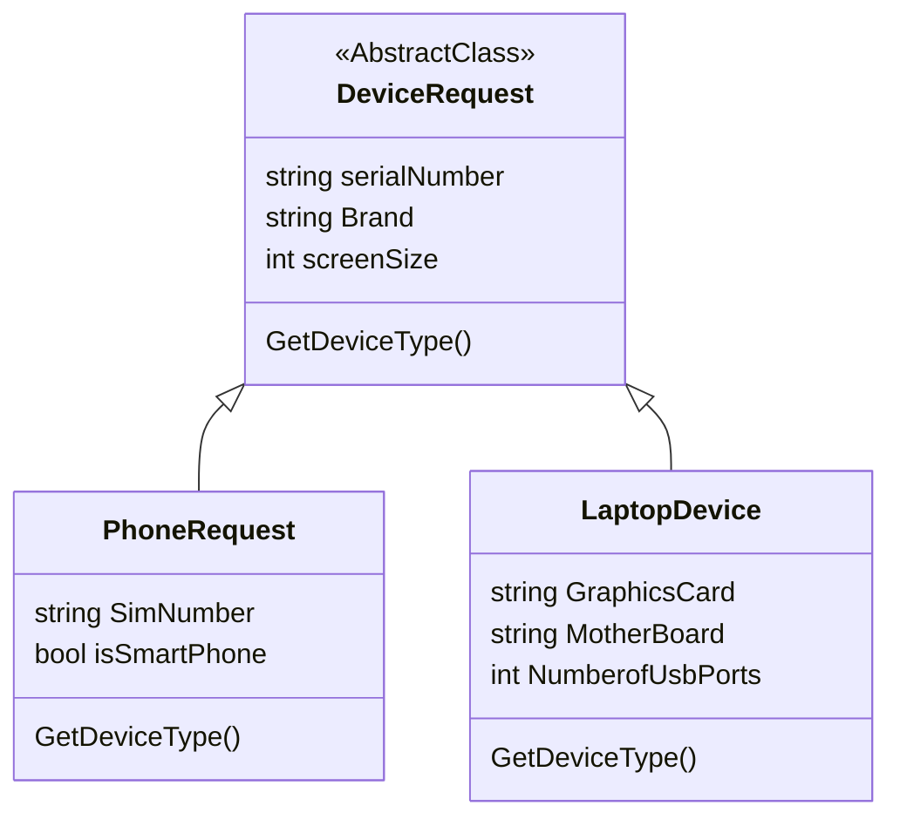

# Swagger Polymorphism

Swagger polymorphism is a feature in the Swagger framework that allows for the definition and handling of polymorphic data models in API specifications. Polymorphism refers to the ability of an object to take on different forms or types. In the context of Swagger, this means that a single endpoint can accept or return multiple types of objects.

With Swagger polymorphism, you can define a base model and then define multiple sub-models that inherit from the base model. Each sub-model can have its own unique properties and characteristics. This enables you to handle different variations or versions of an object within a single API specification.


### Concept Diagram


In this diagram example, ***DeviceRequest*** is the base model, **PhoneRequest** and **LaptopDevice** are sub-models that inherit from the base model. Each sub-model has its own additional properties based on the specific type of object it represents.

Swagger polymorphism in C# refers to the implementation of polymorphic data models in the context of a C# application using the Swagger framework.

In C#, polymorphism can be achieved through inheritance and interfaces. With Swagger, you can define a base model, which serves as the common properties and behavior shared by all the sub-models. Each sub-model can then inherit from the base model and add its own unique properties and characteristics.

To implement Swagger polymorphism in C#, you can use libraries or frameworks that support Swagger, such as Swashbuckle. These libraries provide annotations and attributes that allow you to define the relationships between the base model and its sub-models, specify the type of an object, and provide additional information for proper serialization and deserialization.

### Schema example
```json
{
  "DeviceType": "Laptop",
  "serialNumber": "XCCDLF",
  "brand": "Dell",
  "screenSize": "15",
  "graphicsCard": "Nvidia",
  "motherBoard": "Asus Rock",
  "numberOfUsbPorts": "4"
}
```

```json
{
  "DeviceType": "Smarthphone",
  "serialNumber": "SLDKOI98",
  "brand": "Samsung",
  "screenSize": 5,
  "simNumber": "3094959",
  "isSmartPhone": true
}
```

## NuGet Packages used
- Ardalis.GuardClauses
- JsonSubTypes
- Microsoft.AspNetCore.Mvc.Newtonsoft
- Newtonsoft.Json
- Swashbucle.AspNetCore
- Swashbucle.AspNetCore.Annotations